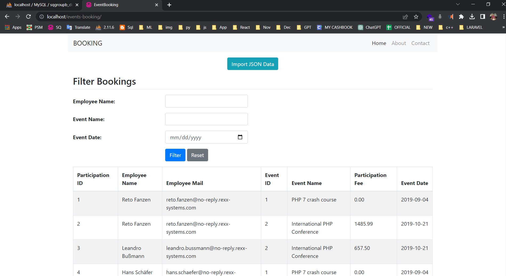
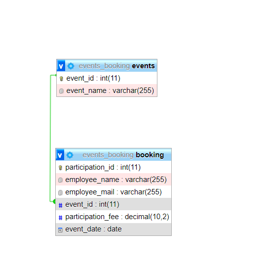

# Event Booking System Integration - PHP OOP

This project aims to integrate an external event booking system's JSON export file into our system. We will design a database scheme for optimized storage, read the JSON data using PHP, and create a simple web page to filter and display the bookings. Additionally, we'll calculate and display the total price of all filtered entries.

## Database Scheme

For optimized storage, we will design a relational database schema with the following tables:

### Table: employees
- employee_id (Primary Key)
- employee_name
- other_employee_details...

### Table: events
- event_id (Primary Key)
- event_name
- event_date
- other_event_details...

### Table: bookings
- booking_id (Primary Key)
- event_id (Foreign Key to events table)
- employee_id (Foreign Key to employees table)
- booking_date
- booking_price
- other_booking_details...

## Instructions

1. Create the necessary database tables using the schema described above in your MySQL/MariaDB database.

2. **JSON Data Import**: Write a PHP script to read the JSON export file from the external event booking system and save it to the database. You can use the `json_decode()` function in PHP to parse the JSON data and `INSERT` statements to add the data to the appropriate tables.

3. **Filter and Display Page**: Create a simple web page (index.php) with filters for employee name, event name, and date. The page should have a form with input fields to enter the filtering criteria.

4. **Filtering and Querying**: In the PHP backend, handle the form submission and query the database based on the filter criteria. Use SQL `SELECT` statements with `JOIN` clauses to fetch the filtered data.

5. **Display Results**: Display the filtered results in a table below the filters. Each row of the table should represent a booking and include information like employee name, event name, event date, booking date, booking price, etc.

6. **Total Price**: Calculate the total price of all the filtered entries and add a last row in the table to display this total.

## How to Run

1. Set up a PHP environment (PHP 7 or higher) and a MySQL/MariaDB database.

2. Import the provided database schema (using SQL queries or a database management tool like phpMyAdmin).

3. Test the application by accessing `index.php` in your web browser.

## Screenshots

